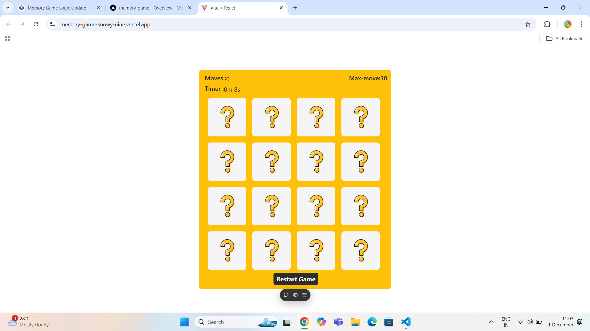

# Memory Game

 

## 🎮 About the Game

The Memory Game is a fun and interactive card-matching game built with React. The objective is simple: flip two cards at a time and try to match all pairs in the fewest moves possible. Test your memory and challenge yourself to complete the game as quickly as you can!

[**Live Demo**](https://memory-game-snowy-nine.vercel.app/)

---

## ✨ Features

- **Interactive Gameplay**: Click cards to reveal images and match pairs.
- **Timer and Move Counter**: Track your progress with a timer and move counter.
- **Responsive Design**: Enjoy seamless gameplay on devices of all screen sizes.
- **Dynamic Shuffling**: Cards are shuffled randomly for a new challenge every time.
- **Win Message**: Celebrate your victory with a congratulatory message when all pairs are matched.

---

## 🚀 Technologies Used

- **React**: A JavaScript library for building the user interface.
- **CSS Modules**: For scoped and maintainable styling.
- **React-Bootstrap**: For quick and responsive UI components.
- **Vercel**: Deployment for live demo and hosting.

---

## 📂 Project Structure

src/ ├── assets/ # Card and placeholder images 
     ├── ResultDisplay/ # Reusable React components to disply the Result (e.g., Card component)
     ├── styles/ # CSS Modules for styling 
     └── App.js # Main game logic and rendering


---

## 🛠️ Features in Detail

1. **Card Matching Logic**:
   - Players click to reveal cards.
   - If two revealed cards match, they remain visible.
   - If they don't match, they hide again after a short delay.

2. **Game Over Condition**:
   - The game announces a win once all pairs are successfully matched.

3. **Timer and Moves**:
   - A timer tracks the total time taken to complete the game.
   - Moves counter displays the total number of card flips.

4. **Responsive UI**:
   - The game layout adjusts dynamically for a great experience on mobile, tablet, or desktop.

---

## 🖥️ How to Run Locally

1. **Clone the Repository**:
   ```bash
   git clone https://github.com/your-username/memory-game.git
   cd memory-game
2. **Install Dependencies**:

  ```bash
Copy code
npm install

3. **Run the Development Server**:

bash
Copy code
npm start
4. **Visit the Game**: Open http://localhost:3000 in your browser.

**🎉 Acknowledgments**
 .Thanks to React for an amazing library.
 .Inspired by traditional memory games we all loved as kids.
 
### How to Use This:

1. **Replace placeholders**:
   - Replace `your-username` with your GitHub username.
   - Add actual screenshots in the `/assets/` directory and update the file paths.
2. **Customize the sections**:
   - Modify any part to suit your preferences or additional features.
3. **Add a License**:
   - If you don't have a license yet, add an `MIT` license or any license of your choice.

This `README.md` will look professional and provide all the essential details for your project on GitHub. Let me know if you need help with further customization!
